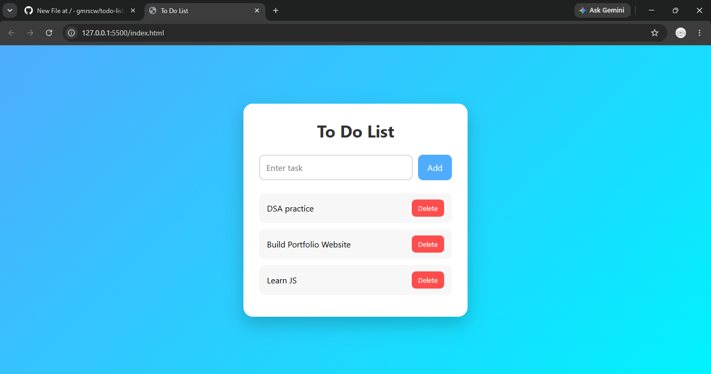

#  To-Do List App

A simple and responsive To-Do List application built using HTML, CSS, and JavaScript.

##  Features

- Add new tasks
- Delete tasks
- Mark tasks as completed
- Clean and responsive user interface

##  Technologies Used

- HTML5
- CSS3
- JavaScript

##  Project Structure

```
todo-list-app/
│── index.html
│── styles.css
└── script.js
```
##  Screenshot



##  Author

Ghulame Mustufa
